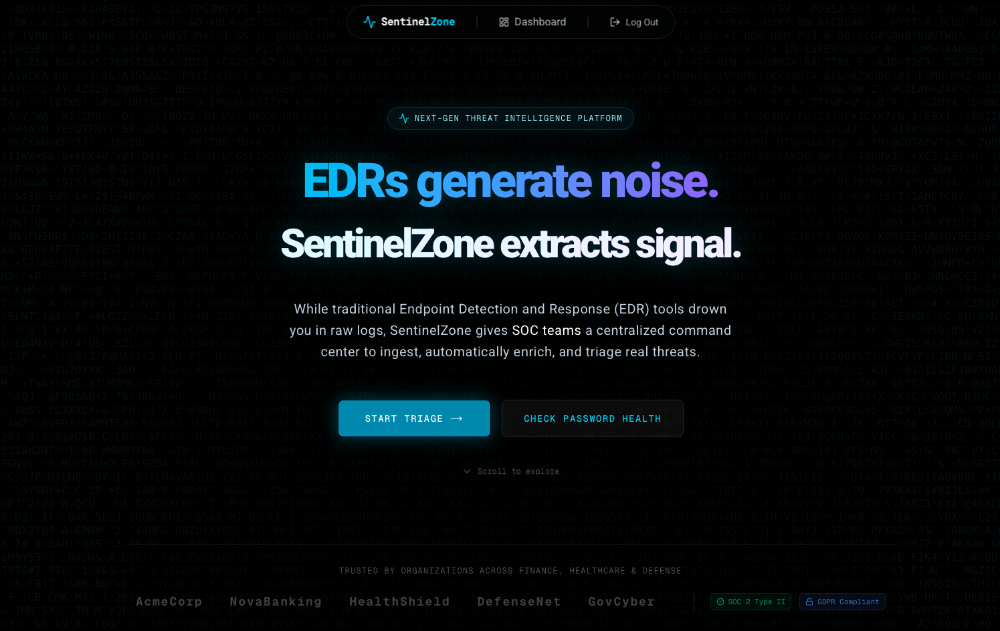
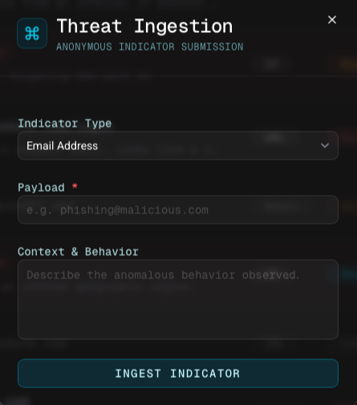
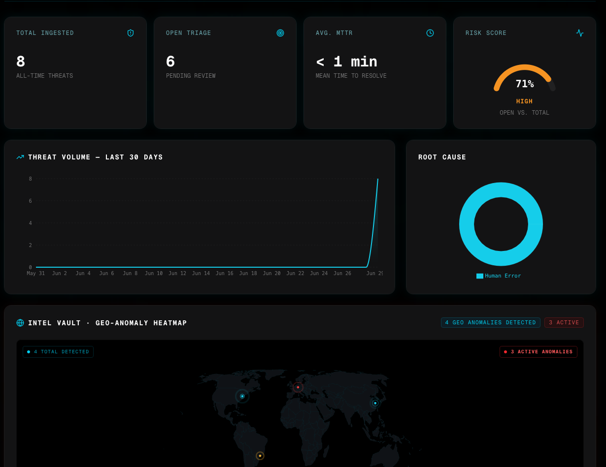
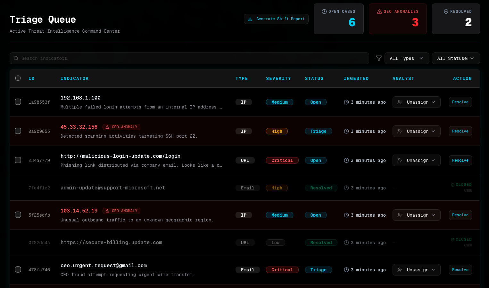

# 🛡️ SentinelZone
**Next-Gen Autonomous SOC: The Future of Threat Ingestion and Geographic Triage.**

> *"EDRs generate noise. SentinelZone extracts signal."*



Modern Security Operations Centers (SOCs) are drowning in alerts. Traditional EDR platforms generate thousands of raw logs daily, creating massive alert fatigue and leading to missed critical threats.

**SentinelZone** is a specialized Threat Intelligence Command Center that solves the "Context Gap." Instead of just aggregating logs, it automatically enriches every submitted indicator with real intelligence — geolocation, reputation scores, breach data, and SSL status — and forces analysts to make justified, explicit decisions when closing cases.

---

## ✨ Core Cyber Capabilities

### 1. Multi-Vector Threat Ingestion & Automated Enrichment
An anonymous public portal accepts Indicators of Compromise (IoCs) from anyone — employees, sensors, or automated scripts. The moment an indicator is submitted, the enrichment engine fires in parallel depending on the payload type:

**🌍 IP Addresses**
- Real-time geolocation via **ip-api** (City, Country, ISP).
- Calculates physical distance from corporate HQ using the **Haversine formula**.
- Supports **Dual-IP mode**: evaluate the physical distance between a *trusted* user IP and a *suspicious* IP simultaneously.
- Automatically escalates severity to **Critical** if distance exceeds the 500km anomaly threshold.

**🔗 URLs / Domains**
- Resolves the domain to an IP via **Node.js DNS** and geolocates the resolved host.
- Executes an **SSL/TLS Probe** on port 443 to verify certificate validity — flags `UNSECURED` if the cert is invalid or self-signed.
- Cross-references the domain against the **OpenPhish Community Feed** to instantly detect known credential harvesters and phishing pages.
- Automatically escalates severity to **Critical** if the URL is confirmed Phishing or SSL is `UNSECURED`.

**📧 Email Addresses**
- Queries the **LeakCheck API** to check if the email appears in known data breach databases — returns the breach count and the names of the compromised databases.
- Validates deliverability and detects disposable/burner email domains via the **Disify API**.
- Automatically escalates severity to **Critical** for breached or disposable addresses.



---

### 2. The "Distance Delta" — Impossible Travel Detection
At the core of SentinelZone is its geographic correlation engine, which detects physically impossible movement patterns.

- **Single-IP Mode:** Calculates distance from the reported IP to corporate HQ (Tel Aviv). Anything beyond 500km is flagged as a **Distance Anomaly**.
- **Dual-IP Mode:** Calculates the real-world distance between a submitted suspicious IP and a trusted user IP. If the gap is physically impossible for a real person to bridge (>500km), the incident is auto-escalated to Critical severity.
- All anomalies are surfaced immediately in the triage queue with a pulsing red **GEO-ANOMALY** badge.

---

### 3. Analyst Command Center — High-Density Triage Queue
A purpose-built dashboard for rapid analyst decision-making.



- **Visual Prioritization:** Geo-Anomalies and critical threats are highlighted in red, allowing analysts to see the highest-priority cases at a glance.
- **Enrichment Panels inside the Resolve Dialog:** When an analyst opens a case, they see a full intelligence panel:
  - **IP/URL cases:** Resolved geolocation (City, Country, ISP), calculated distance in km, SSL status badge, phishing reputation status, and an "Impossible Travel" alert if the distance threshold is breached.
  - **Email cases:** Deliverability check, disposable domain detection, and a full breach report listing every compromised database the email appeared in.
- **Smart Auto-Classification:** The system pre-selects the most likely resolution reason based on the enrichment data, reducing analyst decision time.
- **Mandatory Justified Closure:** Analysts must explicitly classify every closed case as one of:
  - `Human Error` — False Positive / Accidental
  - `Impossible Travel` — Geo-Anomaly Confirmed
  - `Phishing Attempt` — Social Engineering
  - `Malicious Infrastructure` — C2 / Malware Host
- **Shift Report Export:** Analysts can export the entire triage queue as a timestamped `.csv` file for compliance reporting and shift handovers.

---

### 4. Password Health Checker
A standalone security utility for employees to verify if their passwords have been exposed in known breaches.

- Powered by the **HaveIBeenPwned (HIBP) API**.
- Uses **K-Anonymity (SHA-1 hash range)**: only the first 5 characters of the hashed password are sent to the API. The full password **never leaves the browser**.
- Returns the exact number of times the password has been seen in breach databases.
- Recommends immediate password rotation if compromised.

---

### 5. Intel Vault — Threat Analytics
Move from reactive firefighting to proactive threat hunting.



- **Operational KPIs:** Mean Time to Resolution (MTTR), total ingested volume, open triage count, and a real-time Risk Score gauge.
- **Threat Volume Trend:** A 30-day area chart to identify ingestion spikes and coordinated attack patterns.
- **Root Cause Distribution:** A donut chart breaking down resolutions by classification to identify systemic weaknesses.
- **Geo-Anomaly Heatmap:** A live global map plotting all active and detected distance anomalies by coordinates, enabling threat hunters to identify regional attack clusters.

---

## 🛠️ The Sentinel Workflow

1. **Ingest** — A suspicious IoC (IP, URL, or Email) is submitted via the public portal.
2. **Enrich** — The engine runs geolocation, DNS, SSL, phishing feed, breach, and deliverability checks in parallel.
3. **Correlate** — The Distance Delta is calculated. If impossible travel or a known threat signal is detected, severity is auto-escalated.
4. **Triage** — Analysts review the enriched, prioritized case in the Command Center queue.
5. **Resolve** — The analyst reviews the full intelligence panel and closes the case with a mandatory, justified classification.
6. **Report** — The shift's triage data is exported to CSV for compliance and handover.

---

## 🔒 Security Model

- **Anonymous Reporting:** Anyone can submit an IoC — no account required. Enables frictionless, high-volume threat ingestion.
- **Authenticated Triage:** Only authenticated analysts can view the queue, read enrichment data, and resolve incidents.
- **K-Anonymity for Password Checks:** The plaintext password never leaves the user's browser. Only a 5-character SHA-1 prefix is sent to the HIBP API.
- **Row Level Security (RLS):** All data access policies are enforced at the database level (PostgreSQL), not just in application code.

---

## 🚦 Getting Started

```bash
# Install dependencies
npm install

# Copy and configure environment variables
cp .env.example .env.local

# Run the development server
npm run dev
```

### Seeding Mock Data
To populate the database with realistic threat scenarios for testing:
```bash
npx tsx seed.ts
```